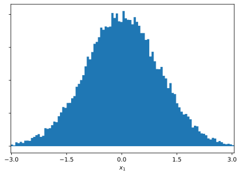
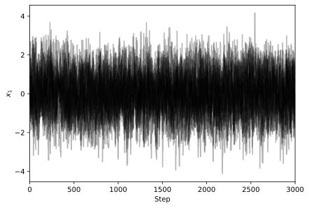
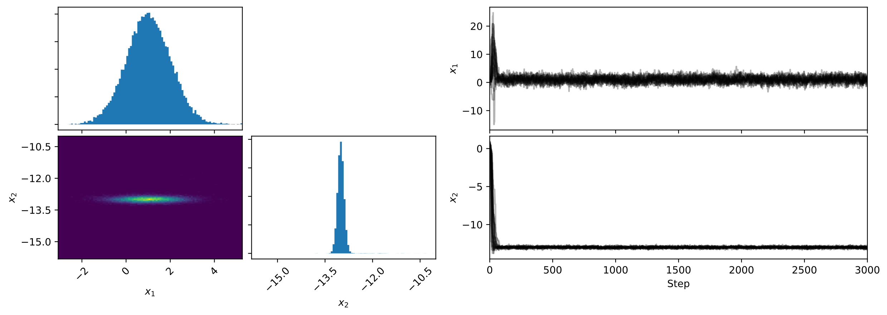
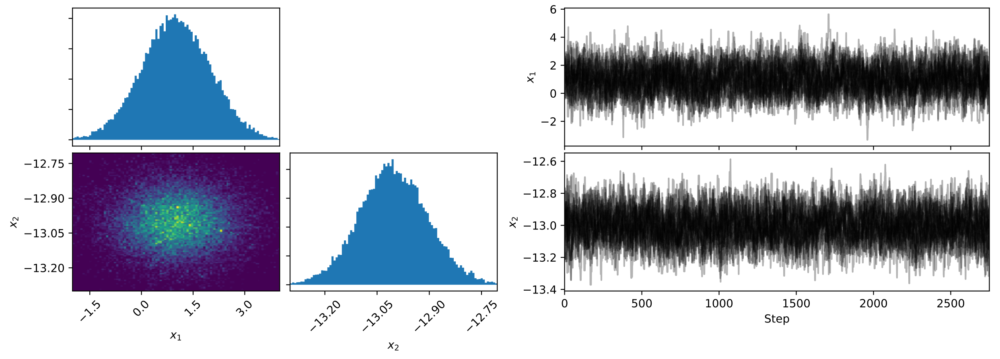

# **tarmac**
Tools for (quickly) visualizing markov chain samples.

[Installation](#Installation)
* [Prerequisites](#Prerequisites)

[Examples](#Examples):
* [Simple sample of a gaussian distribution](#Simple-sampling-of-a-gaussian-distribution)
* [Sampling the product of two gaussian distributions](#Sampling-the-product-of-two-gaussian-distributions)

## **Installation**

To install, use `pip`:

```pip install tarmac```

### **Prerequisites:**
* numpy
* matplotlib


## **Examples**


### **Simple sampling of a gaussian distribution**

Let's use `emcee` to sample from a gaussian distribution, and then use `tarmac` to see what the Markov chains look like. First, some standard imports:

```python
import numpy as np
import matplotlib.pyplot as plt
import emcee
import tarmac
```

Let's define the log-probability gaussian distribution, which is needed by `emcee`. For simplicity, we'll just use a distribution with mean _μ_ = 1 and standard deviation _σ_ = 1:

```python
def ln_gaussian(x):
    μ, σ = 0, 1
    return -np.sqrt(2*np.pi*σ**2) + (-(x-μ)**2/(2*σ**2))
```

Sample from this distribution using `emcee`:

```python
nwalkers = 20
ndim = 1
samples = 3000
init_walker_pos = np.random.rand(nwalkers, ndim)

sampler = emcee.EnsembleSampler(nwalkers=nwalkers, dim=ndim, lnpostfn=ln_gaussian)
sampler.run_mcmc(init_walker_pos, N=samples)
```

Now `sampler.chain` contains the Markov chains which sample from the distribution; this object is an array of shape `(nwalkers, nsamples, ndim)`. Let's plot the resulting distribution using `tarmac`:

```python
fig = plt.figure()
tarmac.corner_plot(fig, chain, labels=['$x_1$'])
```



Seems great! It looks like `emcee` is sampling from the distribution as intended. What about the convergence of the walkers? That's easy to see with `tarmac.walker_trace`:

```python
fig = plt.figure()
tarmac.walker_trace(fig, chain, labels=['$x_1$'])
```

`tarmac.walker_trace` plots the value of each walker at each step. Here, we used 20 walkers, so `tarmac.walker_trace` produces a plot with 20 lines:



The walkers have all converged to the gaussian mean, and are sampling from the distribution in the region of parameter space with most probability. Excellent!

### **Sampling the product of two gaussian distributions**

Now for something slightly more complicated. Let's sample from a bi-gaussian. Define the log-probability and sample from it using `emcee`, just as before. To make things a bit trickier, let's use a product of two gaussians with means (μ1, μ2) = (1, -13) and standard deviations (σ1, σ2) = (1, 0.3):

```python
def ln_doublegaussian(X):
    x1, x2 = X
    μ1, σ1 = 1, 1
    μ2, σ2 = -1, 0.3
    return -np.sqrt(2*np.pi*σ1**2) + (-(x1-μ1)**2/(2*σ1**2)) - np.sqrt(2*np.pi*σ2**2) + (-(x2-μ2)**2/(2*σ2**2))

nwalkers = 20
ndim = 2
samples = 3000
init_walker_pos = np.random.rand(nwalkers, ndim)

sampler = emcee.EnsembleSampler(nwalkers=nwalkers, dim=ndim, lnpostfn=ln_doublegaussian)
sampler.run_mcmc(init_walker_pos, N=samples)

```

Looking at the `tarmac.corner_plot` and `tarmac.walker_trace` plots, it's immediately clear that something is a bit off:



In particular, the `tarmac.walker_trace` shows that the walkers didn't converge until ~200 step into the run. This is a common issue with MCMC sampling, and typically these steps are discarded. This behavior is a direct result of the fact that the walkers were initialized above using a uniform distribution across the interval [0, 1):

```python
init_walker_pos = np.random.rand(nwalkers, ndim)
```

This behavior is nothing to worry about, and if we toss out the first 250 samples we see the walkers are all well behaved:



The corner plot shows the two random variables x1 and x2 are uncorrelated, as expected. The walker trace shows that all walkers have converged. Nice!